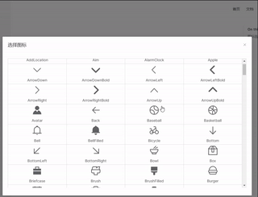

# 基于element-plus，再次封装组件

## 介绍

使用简单：所有组件支持全量引入和按需引入

高拓展性：全新的组件api设计，支持高度自定义

功能全面： 涵盖基础组件，通用组件和业务组件

##   准备

### 安装

本组件基于```element-plus```二次封装，请先安装```element-plus```组件和```@element-plus/icons-vue```
```
npm i element-plus @element-plus/icons-vue
npm i package-element-components
```
### 引入
```ts
// main.ts
import { createApp } from 'vue'
const app = createApp(App)

# element-plus引入参考
'https://element-plus.gitee.io/zh-CN/guide/installation.html'
'https://element-plus.gitee.io/zh-CN/component/icon.html'

# 完整引入
import mUI from 'package-element-components'
import 'package-element-components/style.css'
app.use(mUI)

# 按需引入
import chooseIcon from 'package-element-components/chooseIcon'
import 'package-element-components/chooseIcon/style.css'
app.use(chooseIcon)

app.mount('#app')
```

## 省市区选择组件

通过下拉菜单选择省市区三级联动


### 代码示例
```ts
<div class="choose-area">
  <MChooseArea @change="changeArea" />
</div>

<script lang="ts" setup>
  const changeArea = (data:object) =>{
    console.log(data);
  }
</script>
```
### 参数
| 事件   | 解释                 | 类型                   |
| :----- | -------------------- | ---------------------- |
| change | 选择区（乡镇）后触发 | 返回省市区（乡镇）数据 |

## 城市选择组件

按城市和省份选择中国所有城市，支持搜索和跳转


### 代码示例
```ts
<MChoose @chooseCity="chooseCity"/>

<script setup lang="ts">

  const chooseCity = (val: cityValue|string) => {
    console.log(val);
  }

</script>
```

### 参数

| 参数       | 解释                 | 类型                     |
| ---------- | -------------------- | ------------------------ |
| chooseCity | 选择后返回的city数据 | ():cityValue\|string=>{} |

#### cityValue

| 参数  | 解释       | 类型   |
| ----- | ---------- | ------ |
| id    | 城市的id   | number |
| spell | 城市的短码 | string |
| name  | 城市名     | string |

## 时间选择组件

继承```el-time-select```所有属性；开始时间和结束时间联动


### 代码示例
```ts
<MChooseTime @startChange="startChangeTime" @endChange="endChangeTime" :startOptions="startOptionsTime" :endOptions="endOptionsTime" />

<script setup lang="ts">
    
  interface endChangeTime {
    startTime: string,
    endTime: string
  }
  const startChangeTime = (val:string) =>{
    console.log('startChangeTime=>', val);
  }
  const endChangeTime = (val:endChangeTime) =>{
    console.log('endChangeTime=>', val);
  }
  const startOptionsTime = {
    effect: 'dark'
  }
  const endOptionsTime = {
    format: 'HH时mm分'
  }
  
</script>
```

### 参数

| 参数             | 解释                                    | 类型              |
| :--------------- | --------------------------------------- | ----------------- |
| startPlaceholder | 开始时间的placeholder                   | string            |
| startTimeStart   | 开始时间可选择的最早时间                | Date              |
| startStep        | 开始时间的步长                          | string            |
| startTimeEnd     | 开始时间可选择的最晚时间                | Date              |
| startOptions     | 继承``` el-time-select```的所有其他属性 |                   |
| startChange      | 选择开始时间触发的事件                  | ():startTime =>{} |
| endPlaceholder   | 结束时间的placeholder                   | string            |
| endTimeStart     | 结束时间可选择的最早时间                | Date              |
| endStep          | 结束时间的步长                          | string            |
| endTimeEnd       | 结束时间可选择的最晚时间                | Date              |
| endOptions       | 继承``` el-time-select```的所有其他属性 |                   |
| endChange        | 选择结束时间触发的事件                  | ():endTime =>{}   |

备注：本组件完全继承```el-time-select```所有属性

## 日期选择组件

继承```el-date-picker```所有属性；开始日期和结束日期联动


### 代码示例
```ts
<MChooseDate disableToday @startChange="startChangeDate" @endChange="endChangeDate" />

<script setup lang="ts">
  interface endChangeDate {
    startDate: Date,
    endDate: Date
  }
  const startChangeDate = (val:Date) =>{
    console.log('startChangeDate=>', val); 
  }
  const endChangeDate = (val:endChangeDate) =>{
    console.log('endChangeDate=>', val); 
  }
  
</script>
```

### 参数

| 参数             | 解释                                    | 类型              |
| ---------------- | --------------------------------------- | ----------------- |
| disableToday     | 是否禁用今天之前的日期                  | boolean           |
| startPlaceholder | 开始日期的placeho                       | string            |
| startOptions     | 继承``` el-date-picker```的所有其他属性 |                   |
| startChange      | 选择开始日期触发的事件                  | ():startDate =>{} |
| endPlaceholder   | 结束日期的placeholder                   | string            |
| endOptions       | 继承``` el-date-picker```的所有其他属性 |                   |
| endChange        | 选择结束日期触发的事件                  | ():endDate =>{}   |

备注：本组件完全继承```el-date-picker```所有属性

## 图标选择组件
点击图标，显示所有按钮；点击图标复制代码




### 代码示例
```ts
<MChooseIcon title="选择图标" v-model:visible="visible">选择图标</MChooseIcon>

<script lang="ts" setup>
    
  let visible = ref<boolean>(false)

</script>
```

### 参数


| 参数    | 解释               | 类型    |
| :------ | ------------------ | ------- |
| title   | 弹出框的标题       | string  |
| visible | 控制是否显示弹出框 | boolean |

## 表单组件
整合多种input模式的表单


### 代码示例
```ts
  <MForm ref="form"
    label-width="100px" 
    :options="options"
    @onPreview="onPreview"
    @onRemove="onRemove"
    @onSuccess="onSuccess"
    @onError="onError"
    @onProgress="onProgress"
    @onChange="onChange"
    @onExceed="onExceed"
    @beforeUpload="beforeUpload"
    @beforeRemove="beforeRemove"
  >
    // 上传文件专用
    <template #uploadArea>
      <el-button type="primary">上传文件</el-button>
    </template>
    <template #uploadTip>
      <div class="el-upload__tip">jpg/png files with a size less than 500KB.</div>
    </template>

    <template #action="{form, model}">
      <el-button type="primary" @click="submitForm(form, model)">提交</el-button>
      <el-button @click="resetForm">重置</el-button>
    </template>
  </MForm>
```

### 参数

| 参数                                                         | 解释                      | 类型 |
| ------------------------------------------------------------ | ------------------------- | ---- |
| onPreview，onRemove，onSuccess，onError，onProgress，onChange，onExceed，beforeUpload，beforeRemove | 参考```el-form```对应事件 |      |

```
// options类型
interface FormOptions {
  // 表单项显示的元素
  type: 'cascader'|'checkbox'|'checkbox-group'|'checkbox-button'|'color-picker'|'data-picker'|'input'|'input-number'|'radio'|'radio-group'|'radio-button'|'rate'|'select'|'option'|'slider'|'switch'|'time-picker'|'time-select'|'transfer'|'upload'|'editor',
  // 表单项的值
  value?: any,
  // 表单项的label
  label?: string,
  // 表单项的标识
  prop?: string,
  // 表单项的验证规则
  rules?: RuleItem[],
  // 表单项的占位符
  placeholder?: string,
  // 表单元素特有属性
  attrs?: {
    // css样式
    style?: CSSProperties,
    clearable?: boolean,
    showPassword?: boolean,
    disabled?: boolean
  },
  // 表单项的子元素
  children?: FormOptions[],

  // 处理专用于v-upload上传组件的属性方法
  httpRequest?: Function,
  uploadAttrs?: {
    action: string,
    headers?: object,
    method?: 'post'|'put'|'path',
    multiple?: boolean,
    data?: any,
    name?: string,
    withCredentials?: boolean,
    showFileList?: boolean,
    drag?: boolean,
    accept?: string,
    fileList?: any,
    listType?: "text"|"picture"|"picture-card",
    autoUpload?: boolean,
    disabled?: boolean,
    limit?: number
  }
}
```

## 导航菜单组件

侧边菜单栏，支持无限层级

### 代码示例
```ts

<MInfinitMenu class="m-infinit-menu" :data="data" defaultActive="3-1-1-1" />

<script lang="ts" setup>
const data = [
  {
    name: '导航1',
    index: '1',
    icon: 'document'
  }, {
    name: '导航2',
    index: '2',
    icon: 'document'
  }, {
    name: '导航3',
    index: '3',
    icon: 'document',
    children: [
      {
        name: '导航3-1',
        index: '3-1',
        icon: 'document',
        children: [
          {
            name: '导航3-1-1',
            index: '3-1-1',
            icon: 'document',
            children: [
              {
                name: '导航3-1-1-1',
                index: '3-1-1-1',
                icon: 'AddLocation'
              },
            ]
          },
        ]
      },
    ]
  },
]

</script>
```

### 参数
| 参数   | 解释                                                         | 类型    |
| :----- | ------------------------------------------------------------ | ------- |
| data   | 菜单节点内容                                                 | menu[]  |
| router | 是否启用 `vue-router` 模式。 启用该模式会在激活导航时以 index 作为 path 进行路由跳转 使用 `default-active` 来设置加载时的激活项。 | boolean |

#### menu

| 参数     | 解析       | 类型   |
| -------- | ---------- | ------ |
| name     | 导航的名称 | string |
| index    | 唯一标识   | string |
| icon     | 图标       | string |
| children | 子节点     | menu[] |

## 弹出表单组件
在```MForm```基础上，dialog弹出框集成表单组件

### 代码示例

```ts
<div class="m-model-form">
  <el-button @click="visible = true">填表</el-button>
</div>
<MModelForm 
  v-model:visible="visible"
  title="编辑表单"
  width="50%"
  max-height="500px"
  formLabelWidth='100px'
  :options="options" 
  :onPreview="onPreview"
  :onRemove="onRemove"
  :onSuccess="onSuccess"
  :onError="onError"
  :onProgress="onProgress"
  :onChange="onChange"
  :onExceed="onExceed"
  :beforeUpload="beforeUpload"
  :beforeRemove="beforeRemove"
>
  <template #footer="{form}">
    <el-button @click="cancel(form)">取消</el-button>
    <el-button @click="confirm(form)">确认</el-button>
  </template>
  <!-- 上传文件专用 -->
  <template #uploadArea>
    <el-button type="primary">上传文件</el-button>
  </template>
  <template #uploadTip>
    <div class="el-upload__tip">jpg/png files with a size less than 500KB.</div>
  </template>
</MModelForm>
```

### 参数

| 参数           | 解释                | 类型    |
| -------------- | ------------------- | ------- |
| visible        | 展示/关闭弹出框     | boolean |
| formLabelWidth | 弹出框的宽度        | string  |
| maxHeight      | 弹出框的最大高度    | string  |
| 其他属性       | 参考```MForm```组件 |         |

## 通知菜单组件
点击图标，弹出通知项；点击tabs切换不同通知项


### 代码示例
```ts
<MNotification :value="100" :max="99" icon="ChatDotRound">
  <MNotificationList @clickItem="clickItem" @clickAction="clickAction" :list="list" :actions="actions" />
</MNotification>
```

### 参数

#### MNotification

| 参数  | 解释                                        | 类型    |
| :---- | ------------------------------------------- | ------- |
| value | 通知的数目                                  | number  |
| max   | 最大通知数目，超出则显示峰值，例如```99+``` | number  |
| isDot | 是否显示小圆点                              | boolean |
| icon  | 自定义图标                                  | string  |

#### MNotificationList

| 参数        | 解析                    | 类型                            |
| ----------- | ----------------------- | ------------------------------- |
| list        | 数据列表                | LsitOptions[]                   |
| actions     | 操作内容                | ActionOptions[]                 |
| clickItem   | 点击通知条目触发事件    | ():<{LsitOptions, index}>=>{}   |
| clickAction | 点击通知actions触发事件 | ():<{ActionOptions, index}>=>{} |

#### LsitOptions

| 属性    | 解析   | 类型       |
| ------- | ------ | ---------- |
| title   | 主标题 | string     |
| content | 内容   | ListItem[] |


#### ListItem

| 属性    | 解析     | 类型                                       |
| ------- | -------- | ------------------------------------------ |
| avatar  | 图标     | string                                     |
| title   | 子标题   | string                                     |
| time    | 通知时间 | Date                                       |
| tag     | 标签     | string                                     |
| desc    | 描述     | string                                     |
| tagType | 标签风格 | ''\|'success'\|'info'\|'warning'\|'danger' |

#### ActionOptions

| 属性 | 解析     | 类型   |
| ---- | -------- | ------ |
| text | 操作文本 | string |
| icon | 操作图标 | string |

## 进度条组件
继承```el-progress```所有属性，增加动画效果

### 代码示例
```ts
  <MProgress isAnmiate :percentage="60" />
  <MProgress type="dashboard" isAnmiate :time="3000" :percentage="90" :color="colors" />
```

### 参数

| 参数       | 解释             | 类型    |
| :--------- | ---------------- | ------- |
| isAnmiate  | 是否展示动画效果 | boolean |
| time       | 动画时长         | number  |
| percentage | 完成百分比       | number  |

备注：本组件完全继承```el-progress```所有属性

## 表格组件
整合table，支持数据加载前loading等等


### 代码示例
```ts
<div class="m-table">
  <MTable
    :options="options" 
    :data="tableData"
    border
    elementLoadingText="火箭加载中"
    elementLoadingBackground="rgba(122, 122, 122, 0.8)"
    :elementLoadingSvg="svg"
    elementLoadingSvgViewBox="-10, -10, 50, 50"
    @check="check"
    @close="close"
    v-model:editRowIndex="rowEdit.index"
    :rowEditText="rowEdit.text"
    @rowEditConfirm="rowEditConfirm"
    @rowEditCancel="rowEditCancel"
    pagination
    :currentPage="curPage"
    :pageSize="pageSize"
    :total="total"
    paginationAlign="flex-end"
    @sizeChange="sizeChange"
    @currentChange="currentChange"
  >
    <!-- 自定义格式 -->
    <template #date="{scope}">
      <el-icon><Timer /></el-icon>
      {{scope.row.date}}
    </template>
    <template #name="{scope}">
      <el-popover effect="light" trigger="hover" placement="top" width="auto">
        <template #default>
          <div>name: {{ scope.row.name }}</div>
          <div>address: {{ scope.row.address }}</div>
        </template>
        <template #reference>
          <el-tag>{{ scope.row.name }}</el-tag>
        </template>
      </el-popover>
    </template>
    <!-- 操作按钮 -->
    <template #action="{scope}">
      <el-button type="primary" @click="edit">{{rowEdit.text}}</el-button>
      <el-button type="danger">删除</el-button>
    </template>
    <!-- 编辑行按钮 -->
    <template #editRow="{scope, rowConfirm, rowCancel}">
      <el-button type="primary" @click.stop="rowConfirm(scope)">确认</el-button>
      <el-button type="danger" @click.stop="rowCancel(scope)">取消</el-button>
    </template>
    <!-- 编辑单元格按钮 -->
    <template #editCell="{scope, item, checkItem, closeItem}">
      <div style="display: flex; margin-left: 8px;">
        <el-button size="small" type="primary" @click.stop="checkItem(scope, item)">确认</el-button>
        <el-button size="small" @click.stop="closeItem(scope, item)" >取消</el-button>
      </div>
    </template>
  </MTable>
</div>

<script setup lang="ts">
import { ref, reactive, onMounted } from 'vue'
import { TableOptions } from './types';
import axios from 'axios'

interface TableData {
  date: string,
  name: string,
  address: string
}

const options:TableOptions[] = [
  {
    label: '日期',
    prop: 'date',
    align: 'center',
    slot: 'date',
    editable: true
  }, {
    label: '姓名',
    prop: 'name',
    align: 'center',
    slot: 'name',
  }, {
    label: '地址',
    prop: 'address',
    align: 'center',
    editable: true
  }, {
    label: '操作',
    align: 'center',
    action: true
  }
]

const tableData = ref<TableData[]>([])

// loading的svg图标
const svg = `
  <path class="path" d="
    M 30 15
    L 28 17
    M 25.61 25.61
    A 15 15, 0, 0, 1, 15 30
    A 15 15, 0, 1, 1, 27.99 7.5
    L 15 15
  " style="stroke-width: 4px; fill: rgba(0, 0, 0, 0)"/>
`

// 行编辑文本名和动作标识
const rowEdit = reactive({
  text: '编辑',
  index: ''
})

// 编辑按钮
const edit =()=>{
  rowEdit.index = 'rowEdit'
}

// 编辑单元格
const check = (val:any) =>{
  console.log('编辑单元格确认=>', val.scope.row[val.item.prop]);
}
const close = (val:any) =>{
  console.log('编辑单元格关闭=>', val.scope.row[val.item.prop]);
}

// 编辑行
const rowEditConfirm = (scope:any) =>{
  console.log('编辑行确认=>', scope);
}
const rowEditCancel = (scope:any) =>{
  console.log('编辑行取消=>', scope);
}

// 分页
const curPage = ref<number>(1)
const pageSize = ref<number>(10)
const total = ref<number>(0)
const getData = ()=>{
  axios.post('https://mock.apifox.cn/m1/2268695-0-default/api/list', {
    current: curPage.value,
    pageSize: pageSize.value
  }).then((res:any)=>{
    console.log(res);
    tableData.value = res.data.rows
    total.value = res.data.total
    
  })
}
onMounted(getData)
// 每页显示数据的条数
const sizeChange = (val:number) =>{
  pageSize.value = val
  getData()
  
}
// 更改当前页
const currentChange = (val:number) =>{
  curPage.value = val
  getData()
}

</script>
```

### 参数
| 参数                     | 解释             | 类型   |
| :----------------------- | ---------------- | ------ |
| options                  | table的header    | []     |
| data                     | 内容数据         | any[]  |
| elementLoadingText       | loading文案      | string |
| elementLoadingSpinner    | loading图标名    | string |
| elementLoadingBackground | loading遮罩颜色  | string |
| elementLoadingSvg        | loading的svg图标 | string |
| editIcon                 | 可编辑单元格图标 | string |
| rowEditText              | 行编辑的文本名   | string |
| editRowIndex             | 行编辑的动作标识 | number |

```
// type TableOptions
interface TableOptions {
  // 表头
  label: string,
  // 字段名称
  prop?: string,
  // 列宽
  width?: string | number,
  // 对齐方式
  align?: 'left' | 'center' | 'right',
  // 自定义列表模板名称
  slot?: string,
  // 是否代表操作项
  action?: boolean,
  // 是否可编辑单元格
  editable?: boolean
```

## 趋势标记组件
表示上升和下降趋势，支持多种自定义


### 代码示例
```ts
  // 正常趋势
  <MTrend text="营业额" type="up"></MTrend>
  <MTrend text="销售额" type="down"></MTrend>
  // 颜色翻转
  <MTrend text="营业额" type="up" reverseColor></MTrend>
  <MTrend text="销售额" type="down" reverseColor></MTrend>
  // 自定义图标颜色
  <MTrend text="营业额" type="up" iconColor="blue"></MTrend>
  <MTrend text="销售额" type="down" iconColor="black"></MTrend>
  // 自定义文字颜色
  <MTrend text="营业额" type="up" textColor="blue"></MTrend>
  <MTrend text="销售额" type="down" textColor="yellow"></MTrend>
  // 自定义图标
  <MTrend type="up" icon="CaretTop">营业额</MTrend>
  <MTrend type="down" icon="CaretBottom">销售额</MTrend>
```

### 参数
| 参数         | 解释                                                         | 类型           |
| :----------- | ------------------------------------------------------------ | -------------- |
| type         | 上升/下降                                                    | 'up' \| 'down' |
| text         | 文本（优先级高于插槽）                                       | string         |
| textColor    | 自定义文本颜色（优先级高于默认颜色，默认颜色{up: '#f5222d', down: '\#52c41a'}） | string         |
| icon         | 自定义图标                                                   | string         |
| iconColor    | 自定义图标颜色（优先级高于默认颜色，默认颜色{up: '#f5222d', down: '\#52c41a'}） | string         |
| reverseColor | 是否调转颜色（若设置自定义颜色，该属性不生效）               | boolean        |
